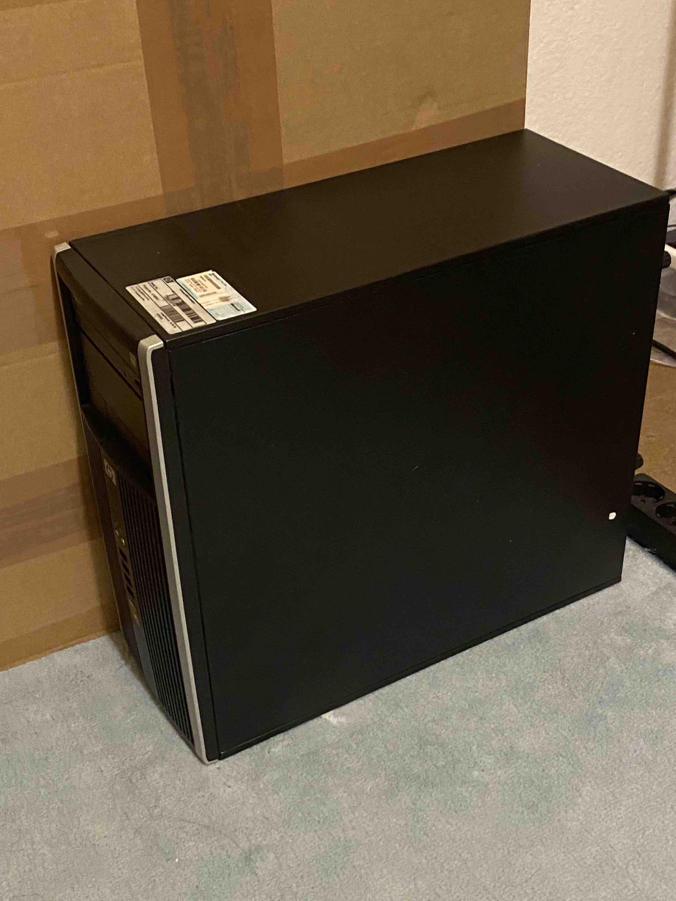

<head>
    
</head>

# MyTools4Sell

## 3d Printer

    

#### Anycubic Vyper 
#### Autolevel bagnetic printbed 
#### With original Packaging and spare parts
#### With half spool Anycubic gray PLA

## Kinect V2

    

#### with developer kit
#### with original packaging

## Behringer Neutron

    
    
    

#### vinyl wraped in white. Can be perminently removed to reveal the original red panel. Panel underneath the wrap is in perfect condition. You can also just remove the colored tags I added to make it look even simpler.
#### One original white patch cable is missing. replaced with a third party cable.
#### Come with original packaging including patch cable, power adapter, eurorack power cable, User mabual, Behringer sticker
#### I wrapped it in white because I don't like the original design. The leds could shine through the wrap in darkroom so I didn't bother making tiny holes for it.

## Beatstep pro

    

#### White version
#### with dust cover
#### with original packaging including micro usb data cable, y power split adapter, two midi to trs adapter and one sync in adapter

## Desktop PC

#### HP Compaq 6005 Pro MT PC
#### I forgot the spec. I will later update this when I get back to Bremen.
#### with windows 7 key
#### with CD reader
#### with free monitor (screen has subtle green tint on one side)
#### with power cable and a usb wifi adapter.

## Simple compact 4 Chanel mixer

#### Behringer Micro MIX MX400
#### with original packing and barely used

[image width]: 200

