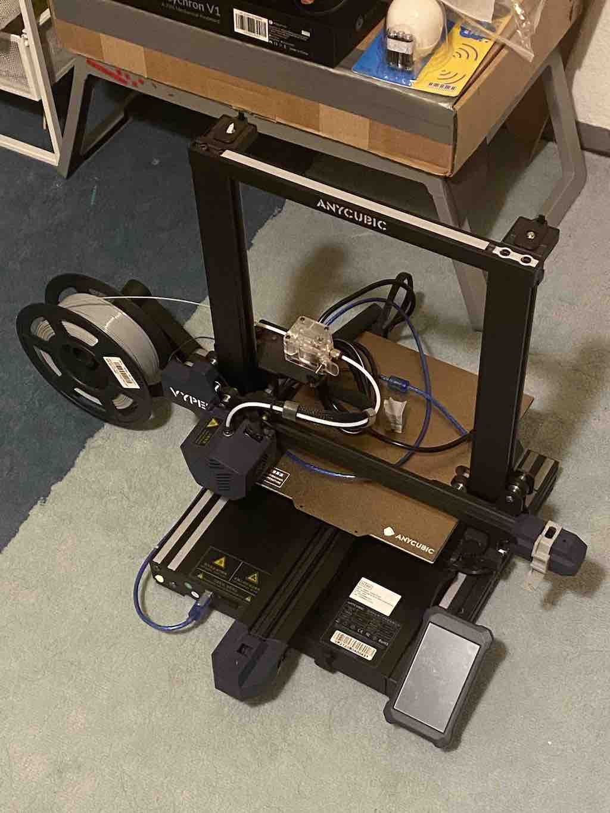
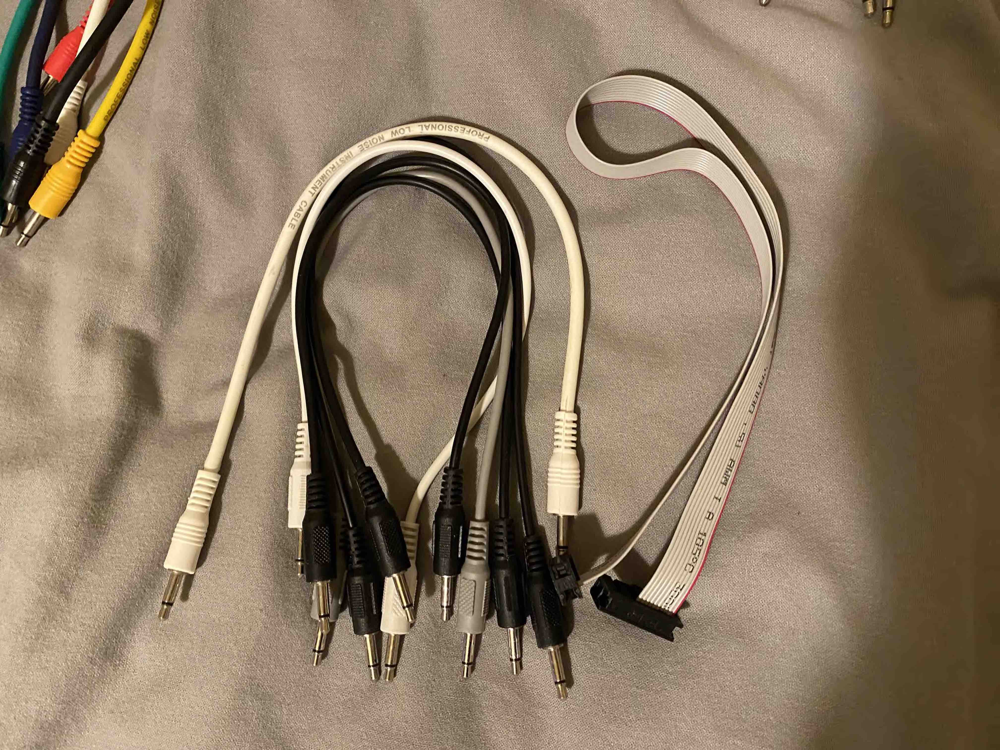
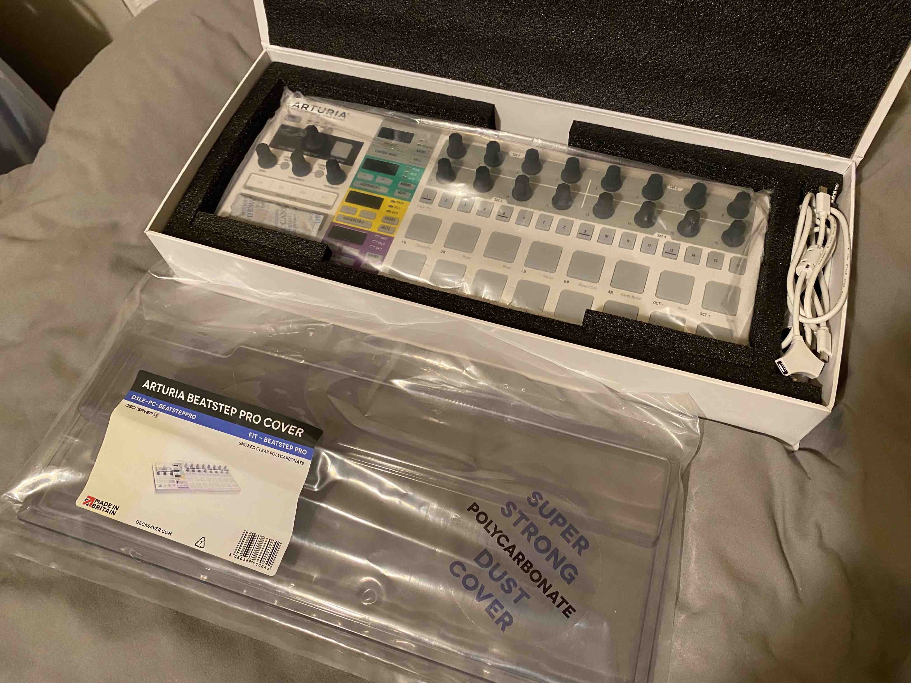
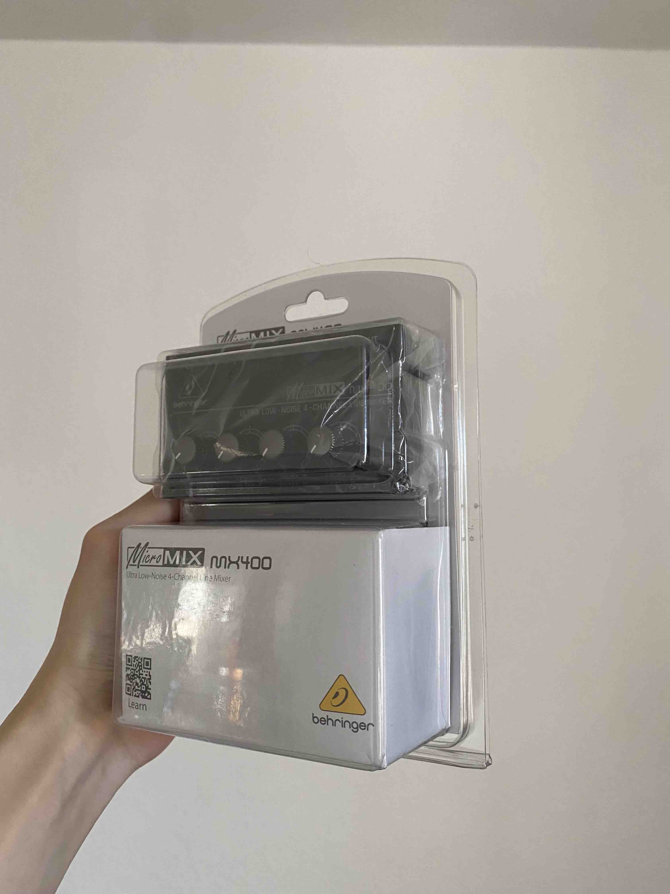

<head>
    
</head>

# MyTools4Sell
---
## 3d Printer

    

#### Anycubic Vyper 
1. Autolevel bagnetic printbed 
2. With original Packaging and spare parts
3. With half spool Anycubic gray PLA
4. The gray strips are dust covers I printed
---

## Kinect V2

    

1. with developer kit
2. with original packaging
---

## Behringer Neutron

    
    
    

1. vinyl wraped in white. Can be perminently removed to reveal the original red panel. Panel underneath the wrap is in perfect condition. You can also just remove the colored tags I added to make it look even simpler.
2. One original white patch cable is missing. replaced with a third party cable.
3. Come with original packaging including patch cable, power adapter, eurorack power cable, User mabual, Behringer sticker
4. I wrapped it in white because I don't like the original design. The leds could shine through the wrap in darkroom so I didn't bother making tiny holes for it.
---

## Beatstep pro

    

1. White version
2. with dust cover
3. with original packaging including micro usb data cable, y power split adapter, two midi to trs adapter and one sync in adapter

---

## Desktop PC

    
    

1. HP Compaq 6005 Pro MT PC
2. I forgot the spec. I will later update this when I get back to Bremen.
3. with windows 7 key
4. with CD reader
5. with free monitor (screen has subtle green tint on one side)
6. with power cable and a usb wifi adapter.
---

## Simple compact 4 Chanel mixer

    
    

1. Behringer Micro MIX MX400
2. with original packing and barely used
---

[image width]: 200

