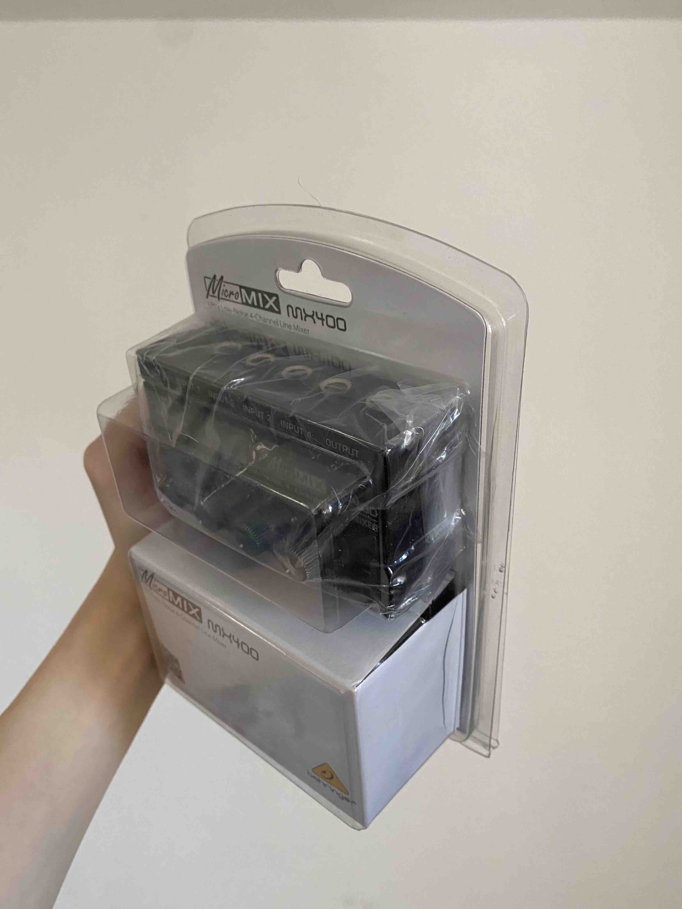

# MyTools4Sell
### My Location: Vorstr Bremen(Near Uni Bremen Campus)
### I can bring the stuff to your place, if yours is close.
### If possible please pay with cash or via Paypal(Only friends/family transfer).
### Please feel free to contact me via Slack and email(hlin@hfk-bremen.de).
---
## 3d Printer €196

    

<a href="https://de.anycubic.com/products/anycubic-vyper?ads&gclid=Cj0KCQjw2cWgBhDYARIsALggUhrQc5Zl_Rdcx68pJOr5C_akuLaQhMQJPNeA29U-TuWhjNMlgUjMjmsaAl9cEALw_wcB">Click here to product page</a>

#### Anycubic Vyper
1. Autolevel magnetic printbed.
2. Build Volume: 245mm(L)×245(W)×260mm(H).
3. With original Packaging and spare parts (already packed back in).
4. With half spool Anycubic gray PLA.
5. The gray strips are dust covers I printed.
6. Come with one half spool gray PLA. It's roughly 500g.
7. I can help you with the installing of this printer.
---

## Kinect V2 with dev kit €50

    
    

1. With developer kit.
2. No scratch.
3. With original packaging.
---

## Behringer Neutron €190

<a href="https://www.behringer.com/product.html?modelCode=P0CM5">Click here to product page</a>

    
    
    

1. vinyl wraped in white. Can be perminently removed to reveal the original red panel. The panel underneath the wrap is in perfect condition. You can also just remove the colored tags I added to make it look even simpler.
2. One original white patch cable is missing. replaced with a third party cable.
3. Come with original packaging including patch cable, power adapter, eurorack power cable, User mabual, Behringer sticker.
4. I wrapped it in white because I don't like the original design. The leds could shine through the wrap in darkroom so I didn't bother making tiny holes for it.
---

## ~~Beatstep pro €220~~ Sold

<a href="https://www.arturia.com/products/hybrid-synths/beatstep-pro/overview">Click here to product page</a>

    

1. White version.
2. With dust cover.
3. Gift card for softwares which came with the sequencer was not used. It's still in the box.
4. With original packaging including micro usb data cable, y power split adapter, two midi to trs adapter and one sync in adapter.
---

## HP Desktop PC （With free monitor and keyboard） €15

    
    
    
    

1. Normaly pick-up only. It's heavy. I can bring it with me When I go to HFK.
2. AMD Phenom(tm) II X3 B75 Processor, 3000 MHz 3 Cores
3. 8GB RAM
4. 250GB storage
5. With windows 7 key.
6. With CD/DVD Drive.
7. With free monitor 1680 x 1050 (screen has subtle green tint on one side).
8. With power cable and a usb wifi adapter.
9. The screen's color is green-ish on the its right side.(As shown in the last image)Its less obvious when showing bright colors.
--- 

## 4 Chanel mixer €12

<a href="https://www.thomann.de/gb/behringer_micromix_mx400.htm">CLick to product page</a>

    
    

#### Behringer Micro MIX MX400
1. Barely used with zero scratch. 
2. Four chaneels mono mixer.
3. With original packing. 
---

[image width]: 200

## Free and very basic HP keyboard (KB-212-B). €0